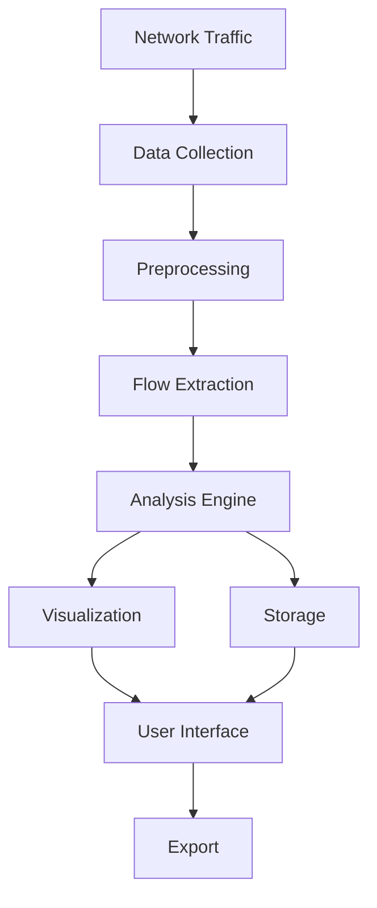
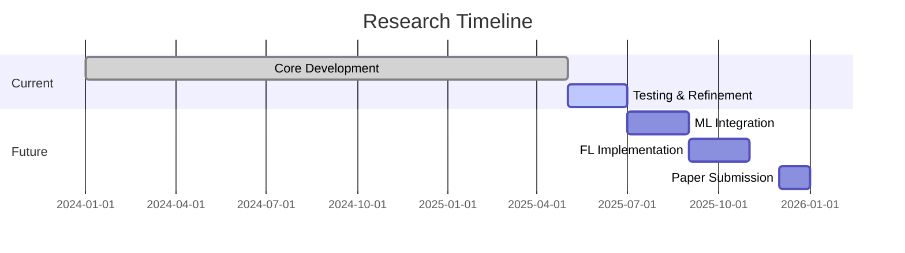

# Research Presentation: MNITJFlowMeter & Federated Learning Research

## Title & Team Members
**Project Title:** MNITJFlowMeter: Advanced Network Analysis & Future Research Directions  
**Team Members:**  
- [Your Name]  
- [Team Member 1]  
- [Team Member 2]  
**Institution:** Malaviya National Institute of Technology Jaipur  
**Date:** June 26, 2025  

---

## Introduction
MNITJFlowMeter represents a sophisticated network traffic analysis tool developed to address the growing need for comprehensive network monitoring and analysis. Built using a modern technology stack including Python, PyQt6, and Scapy, this tool provides real-time traffic monitoring, PCAP file analysis, and interactive visualization capabilities. The system is designed with a modular architecture that allows for easy extension and integration of new features, making it a robust solution for both educational and research purposes in network security and analysis.

---

## Literature Review

### Slide 1: Existing Network Analysis Solutions
The field of network traffic analysis has seen significant advancements in recent years. Traditional tools like Wireshark and Bro/Zeek have set the foundation for network monitoring, while academic contributions such as CICFlowMeter have introduced more specialized analysis capabilities. Recent research has focused on integrating machine learning for anomaly detection and improving real-time processing capabilities. Key papers in this domain have been compiled in our [Google Drive folder](https://drive.google.com/drive/folders/your-folder-id).

### Slide 2: Federated Learning Advancements
The emergence of federated learning has opened new possibilities for privacy-preserving distributed machine learning. Recent works, particularly "Personalized Semantics Excitation for Federated Image Classification" (Xia et al., ICCV 2023), demonstrate significant improvements in handling non-IID data through innovative approaches like semantic excitation modules. These advancements are particularly relevant for our future research direction in privacy-aware network analysis.

---

## Motivation
The development of MNITJFlowMeter was driven by several key factors. First, the increasing complexity of network infrastructures demands more sophisticated analysis tools. Second, existing solutions often lack user-friendly interfaces or comprehensive feature sets. Third, the growing importance of data privacy highlights the need for tools that can facilitate analysis while respecting data sovereignty. These factors collectively motivated our work and continue to guide our research direction toward federated learning applications in network analysis.

---

## Research Objectives
The primary objective of this research is to develop an advanced network analysis tool that addresses current limitations in the field. Specifically, we aim to:

1. Create a user-friendly, feature-rich network traffic analysis platform
2. Implement real-time monitoring and analysis capabilities
3. Develop robust PCAP file processing and visualization tools
4. Lay the foundation for future integration of federated learning techniques
5. Address the challenge of privacy-preserving network analysis in distributed environments

The core problem we're addressing is the lack of accessible, comprehensive tools that balance powerful analysis capabilities with user-friendly interfaces, while also considering future-proofing through privacy-preserving techniques.

---

## Proposed Work

### Current Progress
- [✓] Core flow extraction and analysis engine
- [✓] Basic GUI implementation
- [✓] Real-time monitoring capabilities
- [✓] PCAP file processing
- [ ] Advanced visualization features
- [ ] Integration with machine learning models

### System Architecture

### Future Work
1. Enhance visualization capabilities
2. Implement machine learning-based anomaly detection
3. Develop federated learning integration
4. Optimize performance for large-scale networks
5. Create comprehensive documentation

---

## Target Publications & Technology Stack

### Target Conference
**IEEE/CVF International Conference on Computer Vision (ICCV) 2023**  
**Paper:** "Personalized Semantics Excitation for Federated Image Classification"  
**Authors:** Xia et al.  
**Link:** [Paper on CVF Open Access](https://openaccess.thecvf.com/content/ICCV2023/papers/Xia_Personalized_Semantics_Excitation_for_Federated_Image_Classification_ICCV_2023_paper.pdf)

### Technology Stack
- **Frontend**: PyQt6, PyQtGraph, Matplotlib
- **Federated Learning**: 
  - PyTorch (as used in the ICCV 2023 paper)
  - Additional frameworks as needed
- **Backend**: Python 3.8+
- **Networking**: Scapy, dpkt
- **Data Processing**: Pandas, NumPy
- **Future ML**: PyTorch, Federated Learning Framework

### Research Timeline

---

## Conclusion
The MNITJFlowMeter project represents a significant step forward in network traffic analysis tools, combining powerful features with an accessible interface. Our ongoing research into federated learning applications promises to address critical privacy concerns in network analysis. We believe this work will contribute valuable insights and tools to both the academic community and industry practitioners in network security and analysis.
